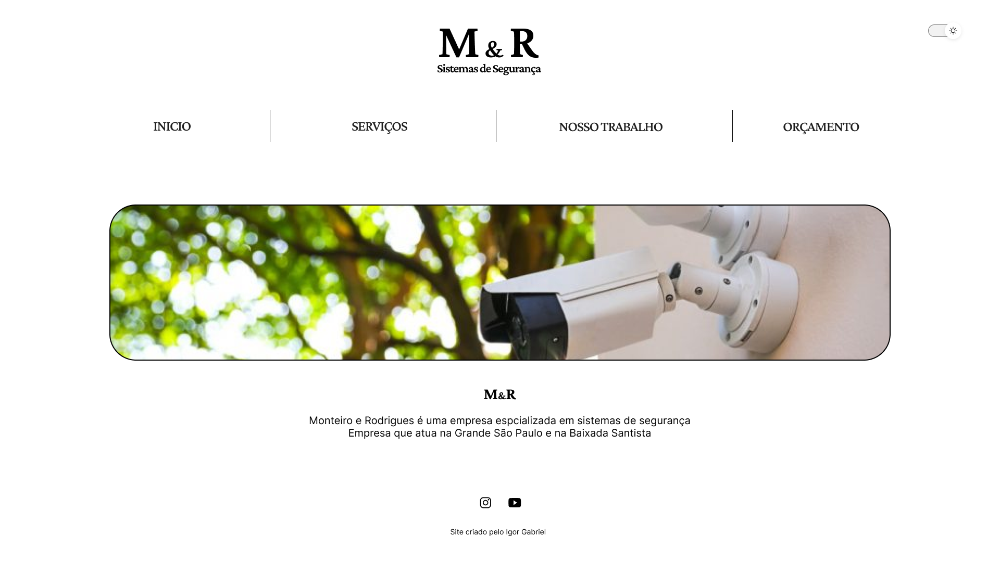

# Projeto Monteiro e Rodrigues - Sistema de Segurança

## Descrição do Projeto

O projeto "Monteiro e Rodrigues - Sistema de Segurança" é um site desenvolvido para um cliente real, uma empresa especializada em soluções de segurança para residências, empresas e condomínios. O objetivo do site é apresentar os serviços oferecidos pela empresa, informações sobre a equipe, portfólio de projetos realizados e formas de contato.

O site foi desenvolvido utilizando as tecnologias HTML, CSS e JavaScript para garantir uma experiência interativa e responsiva para os usuários.

## Funcionalidades

O site oferece as seguintes funcionalidades:

1. **Página Inicial:** Apresenta uma visão geral dos serviços oferecidos pela empresa, bem como informações sobre sua história e compromisso com a segurança.

2. **Trabalhos:** Exibe uma galeria responsiva, em formato de carrosel automático e também com a opção de trocar entre as imagens de forma manual.

3. **Sobre Nós:** Apresentação da equipe Monteiro e Rodrigues, destacando a experiência e competência de seus profissionais.

4. **Orçamentos:** Formulário com a API da StaticForms onde as informações são enviadas ao cliente.

## Equipe

- Igor Gabriel : Desenvolvedor do Projeto
- Maria Helenna : Ideias e melhorias que foram implementadas durante o processo.

## Tecnologias Utilizadas

- HTML
- CSS
- JavaScript
